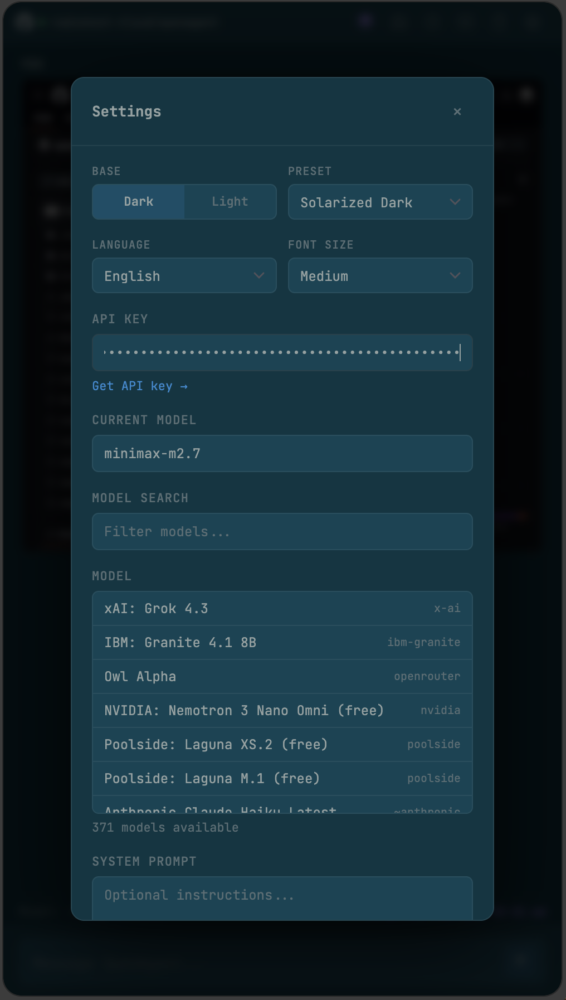
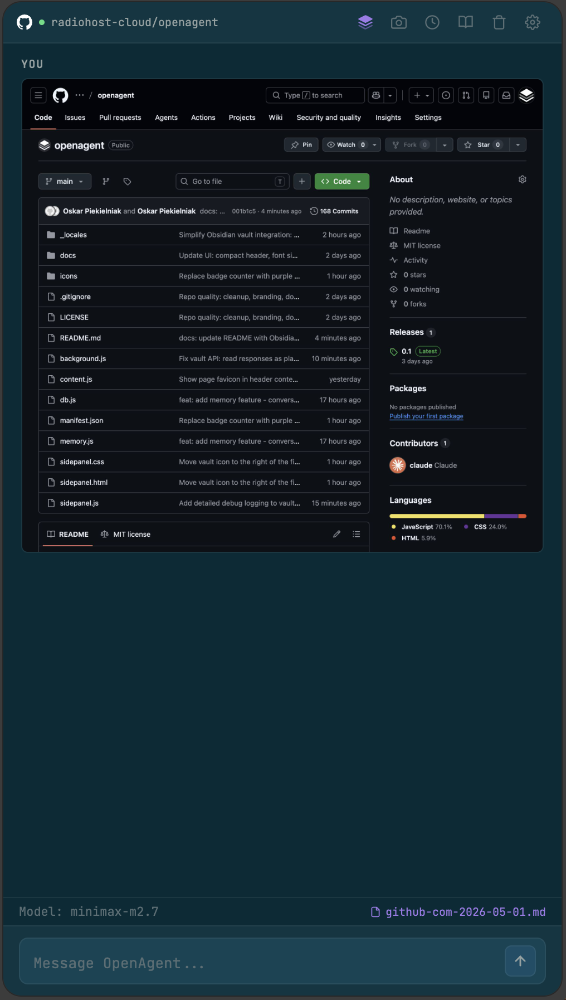
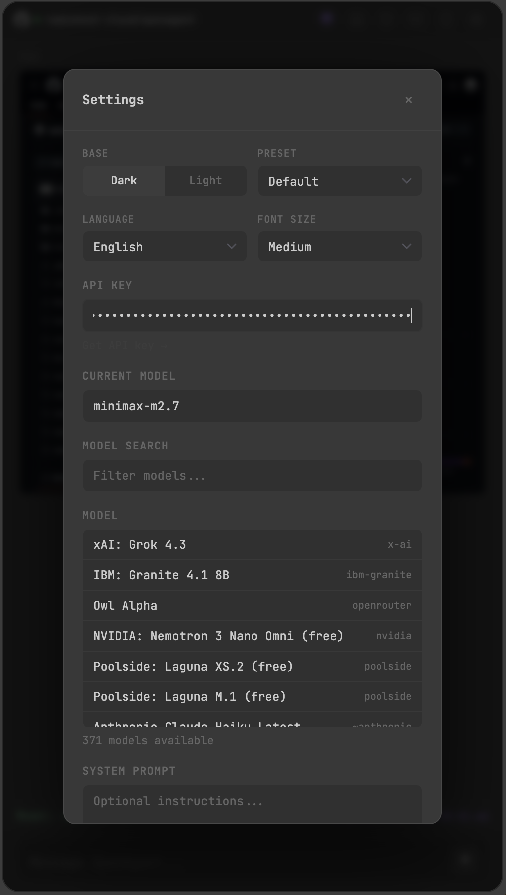
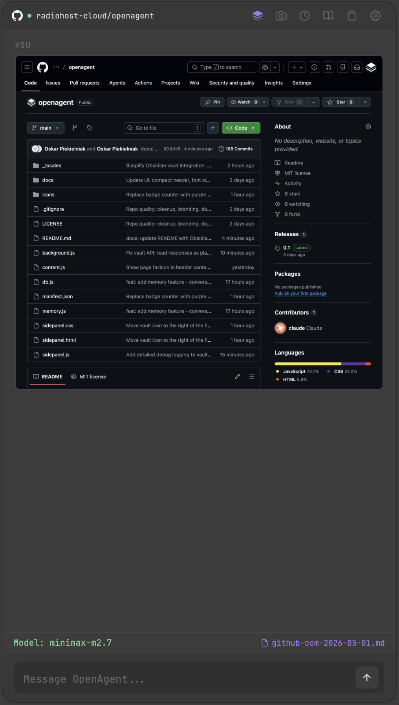
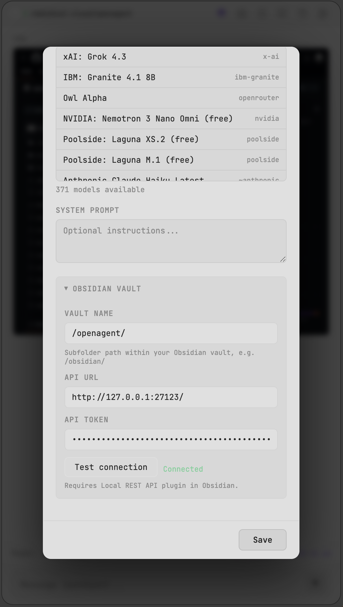
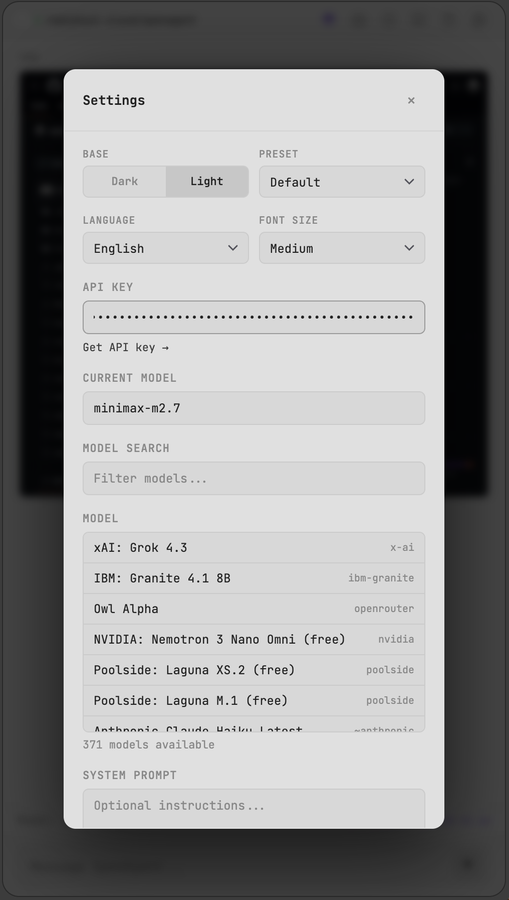
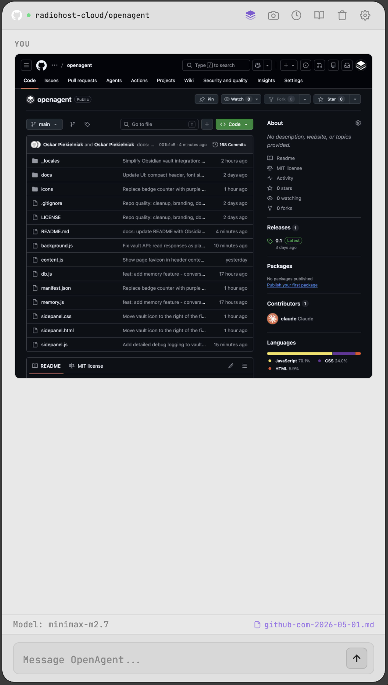
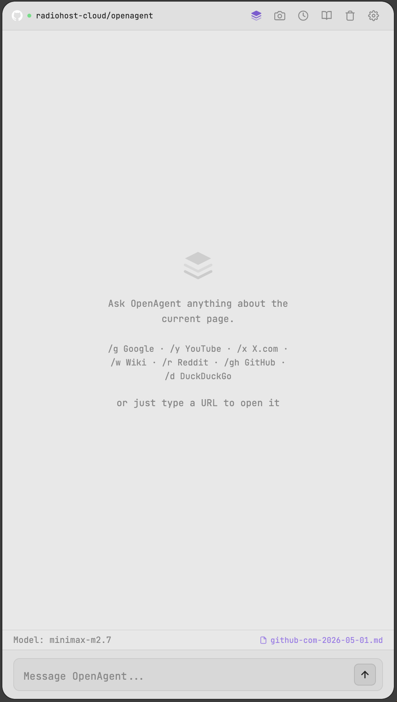

# OpenAgent — Chrome Extension

> AI-powered browser assistant. Chat about any webpage, automate browser actions, and save notes directly to Obsidian — all without leaving your current tab.

<p float="left">
  
  
  
  
  
  
  
  
  
</p>

---

## Features

### 💬 Chat & Memory
- **Chat about any page** — AI understands the content of the current webpage
- **Persistent memory** — AI remembers context from previous conversations, even across different pages and sessions. Key facts and summaries are stored locally in IndexedDB
- **Chat history** — save, resume, and delete conversations; continue them and append messages to the current thread
- **Auto-refresh context** — page context updates automatically when you switch tabs or navigate; cached data shown instantly, refreshed in background

### 📸 Screenshot
- **Screenshot capture** — take a screenshot and send it to vision-capable models (Claude, GPT-4o, Gemini, etc.) for visual analysis
- Vision support auto-detected from OpenRouter API

### 🌐 Navigation & Search
- **Universal address input** — type any URL or domain name directly in the chat field to navigate; works on blank/new tab pages and start pages
- **Quick search shortcuts:**
  - `/g query` — Google
  - `/y query` — YouTube
  - `/x query` — X.com
  - `/w query` — Wikipedia
  - `/r query` — Reddit
  - `/gh query` — GitHub
  - `/d query` — DuckDuckGo

### 🤖 Browser Automation
- **Instruct the AI** to click, type, scroll, or navigate — the AI controls the browser for you

### 📁 Obsidian Integration
- **Auto-save conversations** — every message is automatically appended to a session note in your vault
- **Session notes** — notes are named after the website domain and date (e.g. `github-com-2026-05-01.md`)
- **Vault awareness** — the AI knows it's connected to Obsidian and can read/write notes on demand
- **History resume** — restored conversations sync back to their vault notes automatically
- **Remote access** — works over Local REST API, no need to have Obsidian open on the same machine
- **Requires:** Obsidian desktop app + [Local REST API plugin](https://obsidian.md/plugins?id=obsidian-local-rest-api)

### 🎨 Customization
- **14 color presets** — dark and light themes
- **Adjustable font size** — small, medium, large
- **Multi-language UI** — English, Polski, Español, Français, Deutsch, Русский

### 🔌 OpenRouter
- Use **any model** from OpenRouter's model catalog

---

## Installation

1. Download or clone this repository
2. Open `chrome://extensions/`
3. Enable **Developer mode** (top right corner)
4. Click **Load unpacked**
5. Select the `openagent` directory
6. (Optional) Set a keyboard shortcut in `chrome://extensions/shortcuts`

## Setup

1. Click the extension icon in the toolbar, or use the keyboard shortcut
2. Click **Settings** (gear icon)
3. Paste your [OpenRouter API key](https://openrouter.ai/keys)
4. Pick a model from the dropdown and start chatting

### Obsidian Setup

1. Install the [Local REST API plugin](https://obsidian.md/plugins?id=obsidian-local-rest-api) in Obsidian
2. Enable the plugin in Obsidian settings
3. In OpenAgent settings, expand **Obsidian Vault**
4. Enter:
   - **Vault name** — subfolder path within your vault (e.g. `/obsidian/` or leave empty for root)
   - **API URL** — `http://127.0.0.1:27124` (default)
   - **API Token** — from the Local REST API plugin settings
5. Click **Test connection** — green "Connected" means it's working
6. The vault button in the toolbar turns purple when connected

---

### 🔧 System Prompt (Customization)

You can fully customize the AI's behavior by setting a custom system prompt in **Settings → System Prompt**.

The AI already knows its role by default, but a custom prompt lets you:
- Change its primary focus (e.g., Obsidian-focused note-taking assistant)
- Add domain-specific instructions (e.g., "Always cite sources", "Format code blocks with language tags")
- Define response style and structure

**Vault tools** (available automatically when Obsidian is connected):

| Tool | Usage | Description |
|------|-------|-------------|
| Read notes | `<vault_read query="search terms" />` | Search vault for `.md` files matching the query |
| Write session | `<vault_write>content</vault_write>` | Append to the current session note |
| Write note | `<vault_write filename="topic.md">content</vault_write>` | Create a new `.md` note |

Session notes are automatically saved per conversation and named after the website domain + date (e.g. `github-com-2026-05-01.md`). The AI receives full vault instructions whenever the vault is connected, regardless of your custom prompt.

Leave the system prompt empty to use the default built-in prompt. The AI will always receive page context, memory, and vault capabilities regardless of your custom prompt.

---

## How It Works

The extension analyzes the current webpage and sends the page content to the AI along with your message. The AI can:

- Read page content
- Execute browser actions (click, type, scroll, navigate)
- Write notes directly to your Obsidian vault
- Remember context from previous conversations (stored locally in your browser)

---

## Keyboard Shortcuts

| Shortcut | Action |
|----------|--------|
| `Open side panel` | Configurable in `chrome://extensions/shortcuts` |

---

## Project Structure

```
openagent/
├── manifest.json      # Extension manifest
├── background.js      # Service worker (API calls, routing)
├── content.js        # Content script (FAB, page automation)
├── sidepanel.*       # Side panel UI (chat, settings)
├── db.js             # IndexedDB wrapper (conversations, memory)
├── memory.js         # Memory extraction & matching
├── icons/            # Extension icons
├── docs/             # Screenshots
└── _locales/         # i18n (EN, PL, ES, FR, DE, RU)
```

## License

MIT
